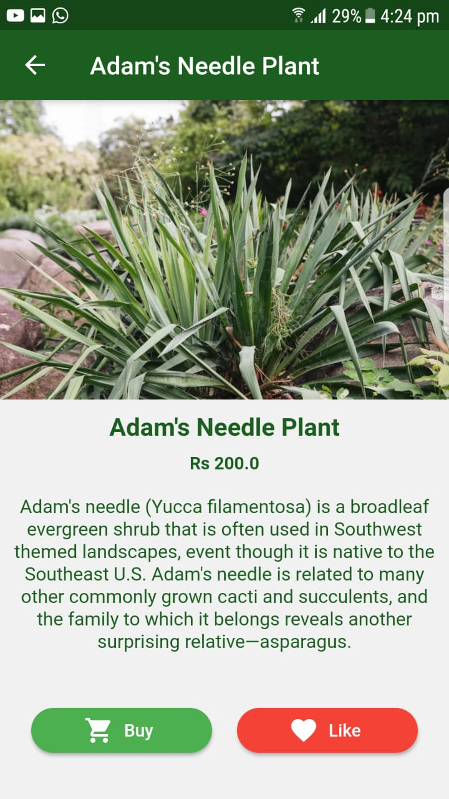
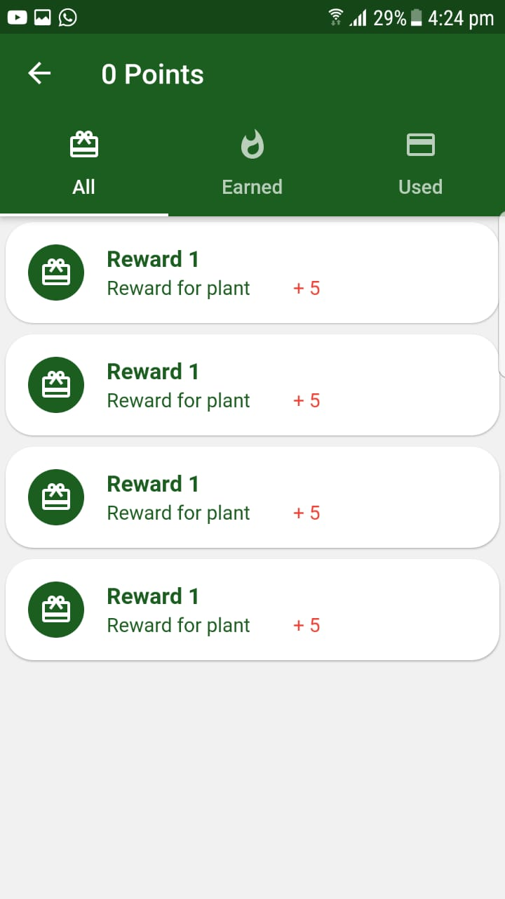
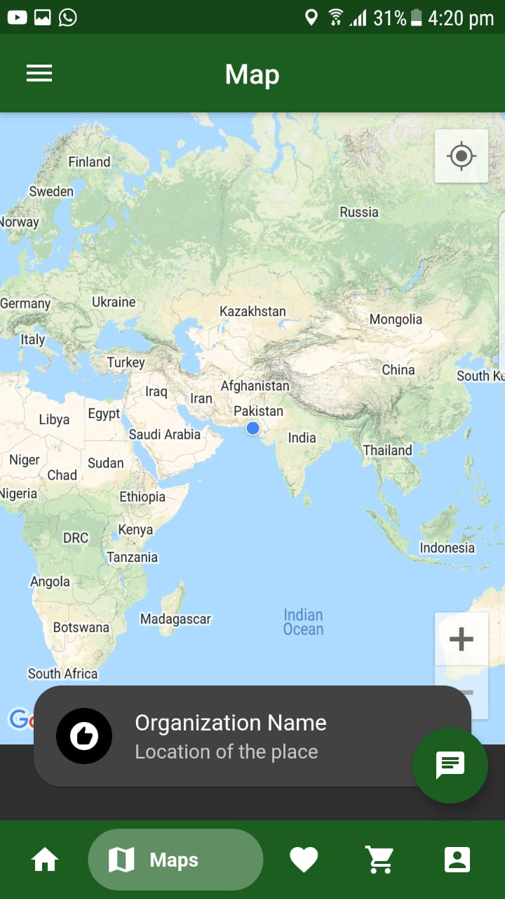

 
<h1>ماحول</h1>

ماحول is an app, through which a user could buy plants and grow them, they will continuously update the growth of plants in pictures and submit to our AI-based system which would reward them small gifts based on their points.

## Like and support Mahool: (click here 👇🏻)

## Tools/Technologies used:

## Application Screenshots:
<table>
  <tr>
    <td></td>
    <td></td>
    <td></td>
  </tr>
 </table>

## Team Members
|  |  |  |
|------------------|--------------|----------------|
| Hassan-ur-Rehman | Afnan Hassan | Muhammad Talha |
| [Github Link](https://github.com/hassanrehman01398) | [Github Link](https://github.com/HassanAfnan) | [Github Link](https://github.com/mtalhadev) |
